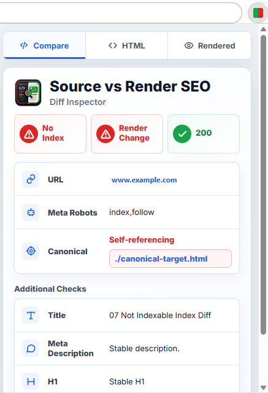

# Source vs Render SEO

Firefox WebExtension for checking how JavaScript rendering changes SEO-relevant signals.

Current version: **1.1.1**

**Source vs Render SEO** compares the raw HTML source of a page with the rendered DOM and shows whether JavaScript changed important SEO fields such as canonical, meta robots, title, meta description, H1s, or hreflangs.



## What It Does

Many SEO issues only become visible after JavaScript has run. This extension checks both versions of a page:

- **Source HTML**: the raw HTML returned by the server before JavaScript execution
- **Rendered DOM**: the final document after JavaScript has modified the page

The extension then highlights differences directly in the popup and updates the toolbar icon to show the current indexability and rendering state.

## Key Features

- Compare raw HTML vs rendered DOM
- Detect JavaScript changes to SEO-critical fields
- Check indexability via `meta robots` and canonical
- Show a state-aware toolbar icon for each page
- Switch between Compare, HTML-only, and Rendered-only modes
- Display inline source-vs-rendered differences next to each field
- Keep visible URLs clickable without visual clutter
- Works on regular websites and locally served test files
- Plain JavaScript, no build step, no bundler

## Checked Fields

Source vs Render SEO currently checks:

- Title
- Meta description
- Meta robots
- Canonical
- H1 values
- Hreflang links
- HTTP status

## Toolbar Icon States

The toolbar icon summarizes indexability and JavaScript changes at a glance.

An indexability change is only shown when the effective indexability changes between source and rendered DOM. For example, adding an explicit `index,follow` meta robots tag or a self-referencing canonical via JavaScript does not count as an indexability change if the source page was already indexable.

| State | Meaning |
|---|---|
| Green | Indexable, no JavaScript difference |
| Red | Not indexable, no JavaScript difference |
| Green + yellow | Indexable, content changed by JavaScript |
| Red + yellow | Not indexable, content changed by JavaScript |
| Green -> red | Source was indexable, rendered page became not indexable |
| Red -> green | Source was not indexable, rendered page became indexable |
| Yellow border | Content and indexability changed |

For indexability changes, the icon direction is always:

```text
Source -> Rendered
```

Example: if the source canonical points to another URL but JavaScript changes it to a self-referencing canonical, the page changes from not indexable to indexable. The icon therefore shows red -> green.

## Popup Modes

The popup has three modes:

- **Compare**: raw HTML source vs rendered DOM
- **HTML**: raw HTML source only
- **Rendered**: rendered DOM only

The selected mode is remembered locally.

## Installation For Development

There is no build step.

1. Clone or download this repository.
2. Open `about:debugging#/runtime/this-firefox`.
3. Click **Load Temporary Add-on...**.
4. Select this project's `manifest.json`.
5. Reload the extension after changing files.

For local regression checks, serving `test-pages/` over HTTP is the most reliable path:

```bash
python -m http.server 8080
```

Then visit `http://localhost:8080/test-pages/`.

## Test Pages

The `test-pages/` directory contains minimal HTML files for all toolbar icon states plus focused regression cases for hreflang changes and explicit index signals added by JavaScript without changing effective indexability.

## Project Structure

```text
manifest.json
icons/
  status/   toolbar state icons
  store/    extension and store icons
src/
  background/service-worker.js
  content/content-script.js
  popup/popup.html
  popup/popup.css
  popup/popup.js
  shared/seo-fields.js
test-pages/
  manual test pages
```

## How It Works

The Firefox MV3 background module fetches the current URL to get the raw HTML source and parses it directly with `DOMParser`.

The rendered DOM is read by the content script. The background module compares both result sets and stores the current tab result in session storage.

The popup reads the stored result and renders:

- indexability status
- render-change status
- HTTP status
- URL, meta robots, and canonical
- additional checks for title, meta description, H1, and hreflangs

## Permissions

The extension uses:

- `activeTab`: access the active tab context
- `tabs`: read active tab metadata and restore per-tab state
- `webNavigation`: detect page loads and SPA navigation
- `storage`: store per-tab results and selected mode
- `scripting`: inject the content script as a fallback
- `<all_urls>`: fetch the raw HTML source of the current page

## Privacy

Source vs Render SEO does not collect, transmit, sell, or share user data.

The extension only analyzes the page you are currently visiting. Results are stored locally in browser session storage and are cleared with the browser session or tab lifecycle.

There are no analytics, no tracking scripts, no remote logging, and no third-party services.

## Changelog

### 1.1.1

- Fixed toolbar icon logic so canonical/meta robots changes only count as indexability changes when effective indexability changes.
- Added regression test page for pages where JavaScript adds explicit index signals while the page remains indexable.
- Added a dedicated hreflang comparison test page.

## License

MIT
